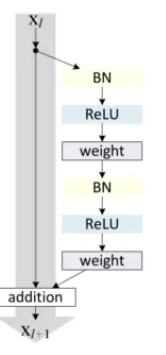
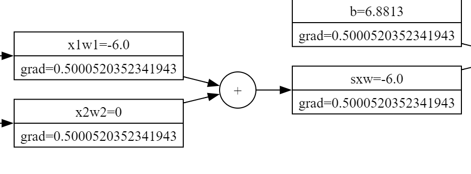

# Squashing Activations and Gradient Issues

Squashing activations like **sigmoid** and **tanh** can cause problems if the inputs are not in their active range. When this happens, the gradients become smaller or even zero.

* Since the gradients for other nodes after a `tanh`/`sigmoid` node are calculated using the **chain rule**, if any of the gradients in an intermediate node (i.e., `∂L/∂W` or simply `Dw`) become zero, then the gradients of all the nodes after that node also become zero.

This is problematic because the later nodes do not receive any significant gradient updates, which means the parameters will be less likely to be updated.

* If the gradients of intermediate nodes are less than 1, the gradients shrink due to the chain rule:

   Example:
0.9 * 0.9 = 0.81

* If gradients of intermediate nodes are greater than 1, they **explode**:

Example:
1.1 * 1.1 = 1.21

In deeper networks, gradients can either **shrink** or **explode** while going from the output layers to the input layers during backpropagation.

Thus, the gradients of all the intermediate layers should somehow have similar means and standard deviations. This is where **ResNets** come in.

 

## How ResNets Help

The **ResNets** help reduce the problem of vanishing/exploding gradients by providing an **alternative path** for gradients to flow in backpropagation.

As we know, the same copy of gradients flows through the **addition node**. In this image, there are two inputs to the addition node:
1. One input simply passes an **identity value**.
2. The other input comes from a very deep network.

Even if this deep network blocks the flow of gradients to **Xl** layer, the other input receives the same gradient information and thus provides a straight way to propagate the gradients into the **Xl** layers.

---

This alternative path in ResNets allows deeper networks to train more effectively by avoiding the vanishing and exploding gradient problem.
